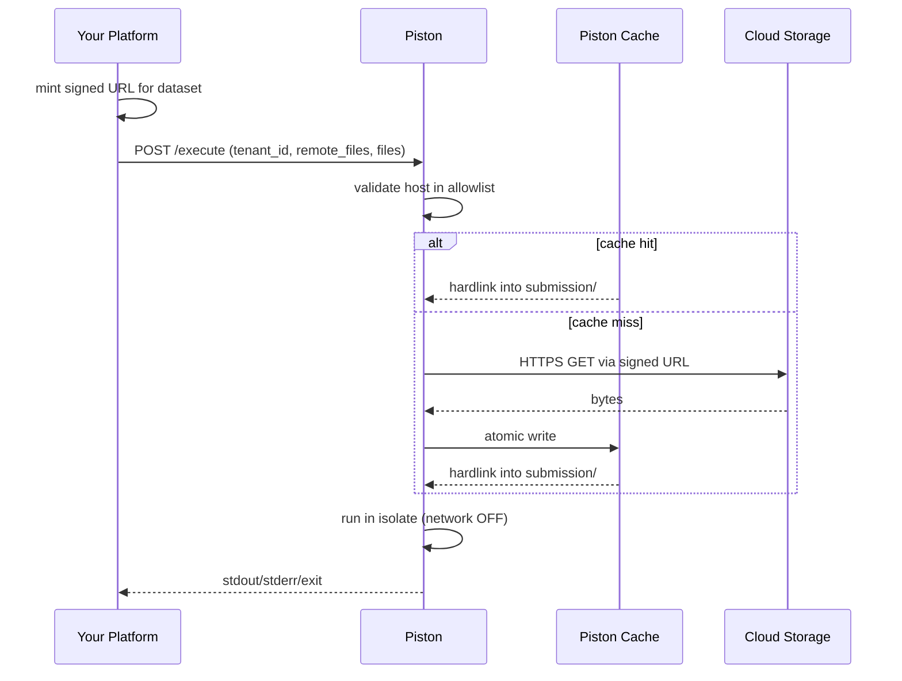

# Remote Files (Signed-URL Datasets)

`remote_files` lets a caller attach datasets stored in cloud object storage (GCS, S3, Azure Blob, MinIO, etc.) to an `execute` request. Piston fetches the bytes from the URL the caller supplies, caches them on disk, and materializes them inside the sandbox at the requested filename. User-submitted code reads them as ordinary local files.

The sandbox itself stays network-disabled; the fetch happens in the API process.

## When to use this

You have datasets that:

-   Don't fit in the request body (or you don't want to re-upload them on every submission).
-   Are reused across many submissions (caching wins).
-   Are tenant-scoped or version-controlled.

You should still pass small per-submission inputs (e.g. user code) via the regular `files` field.

## How it works

1. Your caller (your platform / backend) authenticates the user and authorizes the dataset access.
2. Your caller mints a short-lived **signed URL** for the dataset object, using whatever cloud SDK it already uses.
3. Your caller calls `POST /api/v2/execute` with `tenant_id`, `remote_files: [{ url, name, version }]`, and the regular `files`.
4. Piston validates `tenant_id`, validates the URL host against `PISTON_REMOTE_FILES_HOST_ALLOWLIST`, fetches the bytes (or serves from cache), and hardlinks the file into the sandbox at the given `name`.
5. The sandbox runs the code. Networking inside the sandbox stays off.



## Required configuration

Set these on the Piston API container:

```
PISTON_REMOTE_FILES_ENABLED=true
PISTON_REMOTE_FILES_HOST_ALLOWLIST=storage.googleapis.com
```

For the full list of options see [configuration.md](configuration.md#remote-files).

## API contract

See the `remote_files` and `tenant_id` fields in [api-v2.md](api-v2.md#post-apiv2execute). Brief recap:

```json
{
    "language": "python",
    "version": "3.12.0",
    "tenant_id": "acme-corp",
    "remote_files": [
        {
            "url": "https://storage.googleapis.com/datasets-prod/q1/orders.csv?X-Goog-Algorithm=...",
            "name": "orders_data_sample - Python Training 31Mar2026.csv",
            "version": "1730000000123456"
        }
    ],
    "files": [
        {
            "name": "main.py",
            "content": "import pandas as pd\ndf = pd.read_csv('orders_data_sample - Python Training 31Mar2026.csv')\nprint(df.head())\n"
        }
    ]
}
```

The user's Python code reads the dataset by the supplied `name`, with no awareness of where it came from.

## Caller-side example: NestJS + Google Cloud Storage

This assumes you already have a `GcpService` like the one shown below (extracted from the `skillscaravan` platform), built around `@google-cloud/storage` with Application Default Credentials.

### Step 1: extend `GcpService.getPreSignedUrl` to accept a bucket override

The existing version is hard-coded to the private bucket. For datasets you'll often want a dedicated bucket. Backwards-compatible change:

```ts
public async getPreSignedUrl(
    keyName: string,
    action: SignedActionType = SignedActionType.READ,
    bucketName?: string,
): Promise<string> {
    const bucket = bucketName ?? this.getPrivateBucket();
    const { expiry } = this.configService.get<GcpConfig>('gcp');
    const options: GetSignedUrlConfig = {
        version: 'v4',
        action,
        expires: Date.now() + expiry,
    };
    const [url] = await this.storage
        .bucket(bucket)
        .file(keyName)
        .getSignedUrl(options);
    return url;
}
```

All existing callers keep working (the new arg is optional).

### Step 2: caller service that hits Piston

```ts
import { Injectable, Inject } from '@nestjs/common';
import axios from 'axios';
import { CONFIG_SERVICE } from 'src/Common/constants';
import { ConfigService } from 'src/Common/services/config.service';
import { SignedActionType } from 'src/Common/enum/SignedActionType';
import { GcpService } from 'src/Common/services/gcp.service';

interface PistonExecuteResponse {
    run: {
        stdout: string;
        stderr: string;
        code: number | null;
        signal: string | null;
    };
    language: string;
    version: string;
}

@Injectable()
export class PythonRunnerService {
    constructor(
        private readonly gcpService: GcpService,
        @Inject(CONFIG_SERVICE)
        private readonly configService: ConfigService,
    ) {}

    public async runForQuestion(input: {
        tenantId: string;
        userCode: string;
        datasetBucket: string;
        datasetKey: string;
        datasetFilename: string;
        datasetVersion: string;
    }): Promise<PistonExecuteResponse> {
        const url = await this.gcpService.getPreSignedUrl(
            input.datasetKey,
            SignedActionType.READ,
            input.datasetBucket,
        );

        const pistonUrl = this.configService.get<string>('piston.url');

        const { data } = await axios.post<PistonExecuteResponse>(
            `${pistonUrl}/api/v2/execute`,
            {
                language: 'python',
                version: '3.12.0',
                tenant_id: input.tenantId,
                remote_files: [
                    {
                        url,
                        name: input.datasetFilename,
                        version: input.datasetVersion,
                    },
                ],
                files: [{ name: 'main.py', content: input.userCode }],
                run_timeout: 10000,
            },
            { timeout: 60000 },
        );

        return data;
    }
}
```

### Step 3: end-user code stays unchanged

The student writes ordinary pandas code:

```python
import pandas as pd
df = pd.read_csv("orders_data_sample - Python Training 31Mar2026.csv")
print(df.head())
```

It works because Piston materialized that filename in the sandbox CWD before running.

## Caller-side example: any cloud (S3 etc.)

Anything that mints HTTPS URLs works. Add the host to the allowlist:

```
PISTON_REMOTE_FILES_HOST_ALLOWLIST=storage.googleapis.com,s3.amazonaws.com
```

Mint an S3 presigned URL with `@aws-sdk/s3-request-presigner` (or boto3, etc.) and pass it in `remote_files[].url`. Piston neither knows nor cares which cloud you used.

## Tenant isolation

`tenant_id` is required when `remote_files` is non-empty. The cache key is `sha256(tenant_id || url_path || version)`, so:

-   Tenant A's cached copy of `gs://shared/dataset.csv` is a separate cache entry from Tenant B's copy of the same object.
-   This is intentional. Bucket-level access control is enforced upstream (in your `GcpService`); Piston's tenant scoping prevents misconfiguration leaking across tenants.

`tenant_id` must match `^[a-z0-9][a-z0-9_-]{0,63}$`. Pick something stable and meaningful (your tenant slug or UUID).

## Cache behavior

-   Cache lives at `PISTON_REMOTE_FILES_CACHE_DIR` (default `/piston/remote-files-cache`).
-   Files are atomically written (`.tmp` rename) so a partial fetch never becomes a cache hit.
-   Eviction is LRU on total bytes, capped by `PISTON_REMOTE_FILES_CACHE_MAX_BYTES`.
-   On startup, existing files in the cache directory are re-registered (recency lost; ordered by mtime).
-   Concurrent requests for the same `(tenant_id, url_path, version)` deduplicate to a single fetch.

### Filesystem requirement

Hardlinks require the cache directory and the isolate box root (`/var/local/lib/isolate`) to be on the same filesystem. On startup, Piston `stat()`s both and exits if `st_dev` differs. If you need cross-filesystem layouts, the API falls back to file copy at runtime with a warning, but you lose the cache's performance benefit.

The simplest correct setup: don't mount `/piston/remote-files-cache` as a separate volume. Either:

-   Leave it on overlayfs (default; cache lost on container restart, but warms back quickly).
-   Mount the parent `/piston` (or `/`) as a single volume that also contains `/var/local/lib/isolate`.

## Cold-start latency

The first request for a dataset fetches it inline. A 50 MB CSV from GCS typically takes 3–5 s on a warm connection. After that, all hits are local-disk reads. If your usage pattern punishes cold-start:

-   Bump `PISTON_REMOTE_FILES_FETCH_TIMEOUT_MS` if your datasets are larger than the default 30 s allows.
-   Consider warming the cache by issuing a `remote_files`-only request when a question is published (post-MVP).

## Observability

-   Every resolve and rejection writes a structured JSON line to stdout. Forward stdout to Cloud Logging / Datadog.
    ```json
    {
        "ts": "2026-05-04T07:12:31.998Z",
        "component": "remote_files",
        "event": "resolve",
        "tenant_id": "acme-corp",
        "url_path": "/datasets-prod/q1/orders.csv",
        "version": "1730000000123456",
        "cache": "hit",
        "bytes": 50331648,
        "latency_ms": 7,
        "status": "ok"
    }
    ```
-   In-process counters (cache hits/misses, bytes, errors, evictions) dump to stdout on `SIGUSR1`:
    ```bash
    docker kill --signal SIGUSR1 piston_api
    ```

## Security

-   The URL host allowlist (`PISTON_REMOTE_FILES_HOST_ALLOWLIST`) is the SSRF guard. Keep it tight.
-   Piston requires `https://` scheme. Plain HTTP is rejected.
-   HTTP redirects are rejected. Signed URLs do not redirect; if your caller uses a system that does, resolve redirects upstream.
-   The `name` field is path-escape-checked: `..` segments and absolute paths are rejected.
-   `remote_files` is **disabled by default**. You must opt in via `PISTON_REMOTE_FILES_ENABLED=true`.

## Troubleshooting

| Symptom                                     | Likely cause                                                                                     | Fix                                                                              |
| ------------------------------------------- | ------------------------------------------------------------------------------------------------ | -------------------------------------------------------------------------------- |
| `remote_files is disabled on this Piston`   | Feature flag off                                                                                 | Set `PISTON_REMOTE_FILES_ENABLED=true`                                           |
| `host ... is not in the allowlist`          | URL hostname not configured                                                                      | Add to `PISTON_REMOTE_FILES_HOST_ALLOWLIST`                                      |
| `origin returned HTTP 403`                  | Signed URL expired or insufficient bucket permissions                                            | Mint with longer expiry; verify your platform's IAM grant on the dataset bucket  |
| `tenant_id is required when remote_files`   | Caller forgot `tenant_id`                                                                        | Add it; must match the regex                                                     |
| Hardlink falls back to copy                 | Cache dir and `/var/local/lib/isolate` on different filesystems                                  | Reconfigure mounts (see Filesystem requirement)                                  |
| First request slow, subsequent fast         | Working as designed (cold cache)                                                                 | If unacceptable, prefetch on question publish                                    |
| `remote_files object exceeds max size`      | Object larger than `PISTON_REMOTE_FILES_MAX_OBJECT_SIZE`                                         | Raise the limit, or split the dataset                                            |

## Limits to be aware of

-   Per-object cap: `PISTON_REMOTE_FILES_MAX_OBJECT_SIZE` (default 100 MB).
-   Per-request total cap: `PISTON_REMOTE_FILES_MAX_TOTAL_BYTES` (default 200 MB).
-   Cache total cap: `PISTON_REMOTE_FILES_CACHE_MAX_BYTES` (default 5 GB).
-   Fetch timeout: `PISTON_REMOTE_FILES_FETCH_TIMEOUT_MS` (default 30 s).
-   `tenant_id` format: `^[a-z0-9][a-z0-9_-]{0,63}$`.
-   `name` length: 255 chars; must not escape `submission/`.
-   `version` length: 128 chars.

## Escalation path

The current implementation is sized for a single API replica with one local cache. When you outgrow that:

-   **Multiple replicas**: extract the cache to a sidecar / shared volume; or accept per-replica caches (still high hit rate per replica).
-   **Cross-tenant fairness**: add per-tenant disk quotas in `remote_files.js`'s eviction logic.
-   **Hard SLOs**: add a Prometheus `/metrics` endpoint exporting the in-process counters; pre-warm critical datasets via a publish hook.
